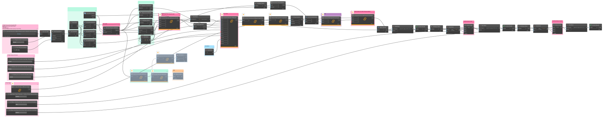
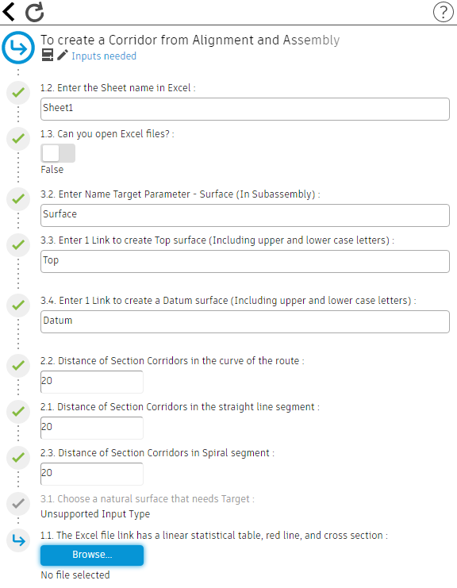

# Tạo Corridor từ Alignment và Assembly bằng Dynamo Civil 3D

Trong thiết kế hạng mục giao thông bằng phần mềm Autodesk Civil 3D, việc tạo Corridor từ Alignment và Assembly là rất quan trọng để tạo dựng mô hình và thiết kế dự án chính xác. Sử dụng Dynamo Civil 3D, kết hợp với các gói **Camber** và **Civil3DToolkit**, cung cấp khả năng tự động hóa mạnh mẽ để hợp lý hóa quy trình này.  

Blog này sẽ hướng dẫn bạn các bước để tạo Alignment và Assembly bằng Dynamo (IronPython), dựa trên các tham số đầu vào từ tệp Excel đã lập sẵn.

## Giới thiệu

Việc tạo Corridor trong Civil 3D liên quan đến việc mô hình hóa các tuyến đường hoặc các dự án tuyến tính khác một cách chính xác là điều cần thiết.  

Sử dụng [Dynamo](https://boogu.gumroad.com/l/tocreateaCorridorfromAlignmentandAssembly?layout=profile) Civil 3D giúp tăng cường quy trình này bằng cách tự động hóa các tác vụ lặp đi lặp lại, đảm bảo tính nhất quán trong thiết kế và giảm thời gian làm việc.

## Điều kiện tiên quyết

Trước khi bắt đầu, hãy đảm bảo bạn đã cài đặt những điều sau:

- Autodesk Civil 3D trên máy tính của bạn.
- Dynamo Civil 3D và các gói **Civil3DToolkit**, **Camber**.
- Tệp Excel chứa các tham số đầu vào (có đính kèm file excel mẫu).

## Các bước để tạo Corridor

### Bước 1: Thiết lập môi trường [Dynamo](https://boogu.gumroad.com/l/tocreateaCorridorfromAlignmentandAssembly?layout=profile)

1. Khởi chạy Autodesk Civil 3D và mở tệp dự án của bạn.  
2. Khởi động Dynamo từ tab **Add-ins** trong Civil 3D.  

### Bước 2: Xác định tham số đầu vào

Đọc và phân tích tệp Excel trong Dynamo để trích xuất:

- Tên tuyến (`AlignmentName`)
- Tên Profile alignment (`DesignedProfileAlignment`)
- Mặt cắt ngang Assembly trong file bản vẽ (`CrossSectionAssembly`)
- Khoảng cách các section (`SectionSpacing`)

### Bước 3: Tạo tập lệnh Dynamo

Sử dụng các node Dynamo từ các gói Camber và Civil3DToolkit ([click để xem script](https://boogu.gumroad.com/l/tocreateaCorridorfromAlignmentandAssembly?layout=profile)) để:

- Tạo tuyến (`AlignmentName`)
- Thêm Profile Alignment (`DesignedProfileAlignment`)
- Gán Assembly (`CrossSectionAssembly`)
- Đặt khoảng cách section (`SectionSpacing`)

### Bước 4: Thực thi tập lệnh

Chạy script Dynamo để tự động tạo Corridor dựa trên các số liệu đầu vào từ Excel.  

### Bảng tóm tắt các bước

| Bước | Mô tả | Công cụ/Tham số chính |
|------|-------|------------------------|
| 1    | Thiết lập môi trường Civil 3D và mở Dynamo | Civil 3D + Dynamo |
| 2    | Đọc dữ liệu từ Excel | AlignmentName, DesignedProfileAlignment, CrossSectionAssembly, SectionSpacing |
| 3    | Tạo script trong Dynamo | Node từ Camber & Civil3DToolkit |
| 4    | Thực thi script | Tự động tạo Corridor trong Civil 3D |

### Lợi ích của Tự động hóa

  

- **Hiệu quả**: Tự động hóa các tác vụ lặp đi lặp lại, tiết kiệm thời gian và giảm lỗi thủ công.

- **Độ chính xác**: Đảm bảo tính nhất quán và độ chính xác trong thiết kế hành lang và tạo bề mặt.

- **Tích hợp**: Tích hợp liền mạch với Civil 3D đảm bảo khả năng tương thích với các quy trình công việc hiện có.

- **Tùy chỉnh**: Cung cấp tính linh hoạt để điều chỉnh các thông số và thiết kế riêng theo các yêu cầu cụ thể của dự án.

  

### Kết luận

  

Việc tự động hóa việc tạo Corridor bằng Dynamo Civil 3D với Camber và Civil3DToolkit giúp hợp lý hóa quy trình thiết kế, nâng cao năng suất và cải thiện kết quả dự án. Bằng cách thực hiện theo các bước này, các kỹ sư xây dựng và nhà thiết kế có thể mô hình hóa hiệu quả các tuyến đường và dự án tuyến tính, tận dụng các khả năng tự động hóa tiên tiến.

  

Xem trang chủ để biết thêm nhiều thông tin: [Boo Space Blog](https:boospace.blog)

  

Kho tài nguyên của trang: [Boo Space Gumroad](https://boospace.gumroad.com)

  

Các sản phẩm kèm them: [Linktr](https://linktr.ee/boospace)