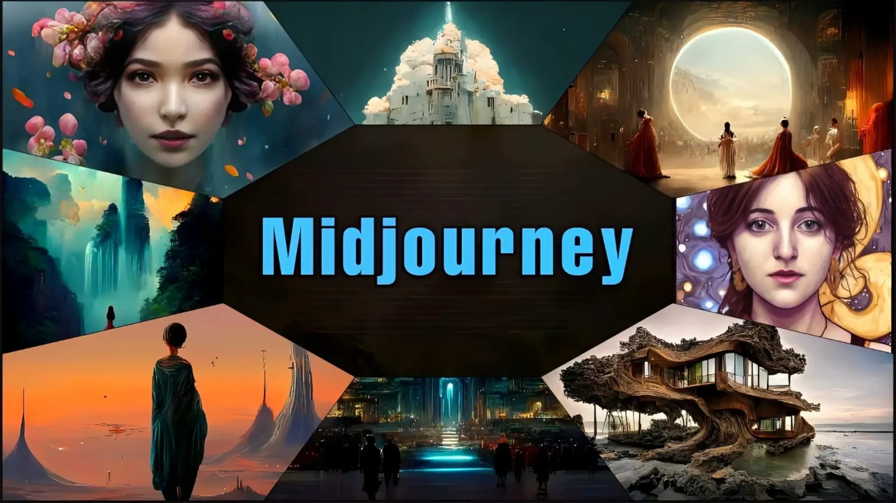
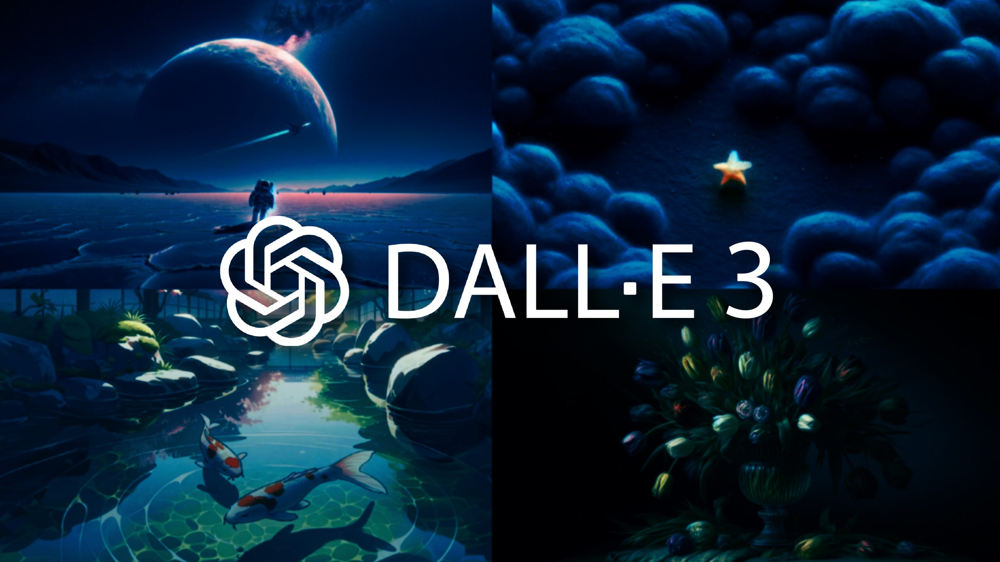
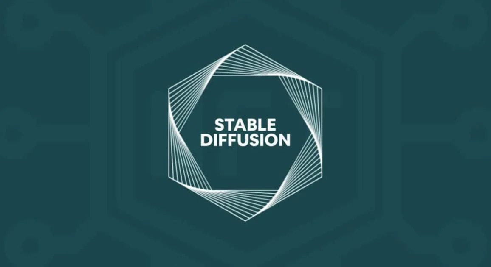
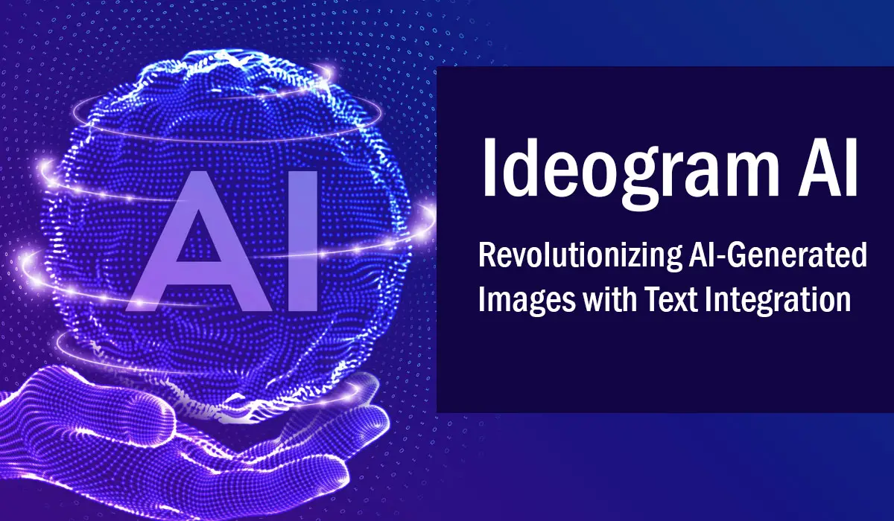
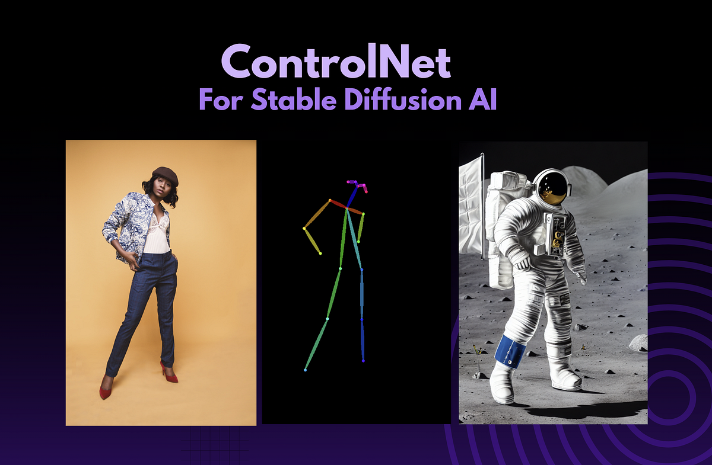
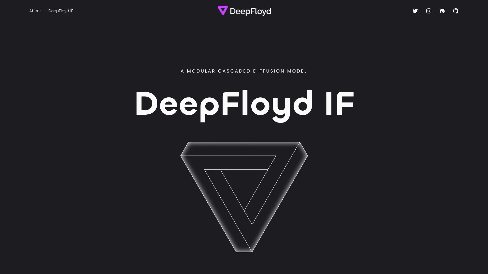

Bạn đã bao giờ ước mình có thể biến những ý tưởng phức tạp nhất trong đầu thành một bức tranh sống động chỉ trong vài giây chưa? Giờ đây, điều đó không còn là khoa học viễn tưởng nữa. Chào mừng bạn đến với kỷ nguyên của AI tạo ảnh (Text-to-Image AI) – một cuộc cách mạng đang thay đổi cách chúng ta sáng tạo và làm việc.

Chỉ với vài dòng mô tả, bạn có thể tạo ra từ những bức tranh nghệ thuật phức tạp đến các hình ảnh sản phẩm chân thực. Nhưng giữa một "rừng" công cụ, đâu là lựa chọn tốt nhất cho bạn?

Bài viết này sẽ là tấm bản đồ chi tiết, dẫn bạn đi qua ba thế giới riêng biệt: những công cụ miễn phí tốt nhất cho người dùng hàng ngày, các API mạnh mẽ cho lập trình viên, và những mô hình mã nguồn mở tiên phong dành cho dân chuyên.

### Phần 1: Sân Chơi Sáng Tạo - Top Công Cụ Miễn Phí Cho Mọi Người

Đây là những công cụ dễ tiếp cận, cho phép bất kỳ ai cũng có thể bắt đầu hành trình sáng tạo của mình mà không cần kiến thức kỹ thuật phức tạp.

#### 1. Midjourney
Nhắc đến AI tạo ảnh nghệ thuật, không thể không kể đến Midjourney. Nền tảng này nổi tiếng với khả năng tạo ra những hình ảnh có phong cách độc đáo, giàu cảm xúc và chất lượng thẩm mỹ vượt trội.

*   **Điểm mạnh:** Chất lượng nghệ thuật đỉnh cao, cộng đồng người dùng sôi nổi.
*   **Điểm yếu:** Hoạt động hoàn toàn trên nền tảng Discord, có thể gây bỡ ngỡ cho người mới bắt đầu. Phiên bản miễn phí có giới hạn.

#### 2. DALL-E 3 (từ OpenAI)
Được tích hợp trực tiếp vào ChatGPT Plus và Microsoft Copilot, DALL-E 3 là "gã khổng lồ" về khả năng thấu hiểu ngôn ngữ tự nhiên. Bạn có thể yêu cầu những chi tiết rất phức tạp và DALL-E 3 sẽ diễn giải chúng một cách đáng kinh ngạc.

*   **Điểm mạnh:** Hiểu sâu các câu lệnh phức tạp, tích hợp liền mạch với các sản phẩm khác của OpenAI và Microsoft.
*   **Điểm yếu:** Phong cách nghệ thuật đôi khi hơi "doanh nghiệp", thiếu sự độc đáo như Midjourney.

#### 3. Stable Diffusion (qua DreamStudio)
Stable Diffusion là trái tim của cuộc cách mạng mã nguồn mở. DreamStudio là giao diện web chính thức giúp bạn trải nghiệm sức mạnh của nó một cách dễ dàng. Nó mang lại sự linh hoạt đáng kinh ngạc, cho phép bạn tinh chỉnh mọi thứ từ phong cách đến bố cục.

*   **Điểm mạnh:** Cực kỳ linh hoạt, mã nguồn mở, cộng đồng lớn mạnh.
*   **Điểm yếu:** Cần một chút thời gian để làm quen với các tham số điều chỉnh.

#### 4. Ideogram
Điểm khác biệt lớn nhất của Ideogram là khả năng **tạo ra văn bản trong ảnh một cách chính xác**. Nếu bạn cần thiết kế logo, poster, hay bất cứ thứ gì có chứa chữ, Ideogram là lựa chọn không thể bỏ qua.

*   **Điểm mạnh:** Xử lý văn bản trong ảnh tốt nhất hiện nay.
*   **Điểm yếu:** Chất lượng hình ảnh tổng thể đôi khi chưa bằng các đối thủ hàng đầu.

### Phần 2: Dành Cho Nhà Phát Triển - Các API Mạnh Mẽ Nhất

Nếu bạn muốn tích hợp khả năng tạo ảnh AI vào ứng dụng, website hay quy trình làm việc của mình, API chính là cây cầu nối.

#### 1. API của OpenAI (DALL-E)
Với uy tín từ nhà sáng tạo ChatGPT, API DALL-E cung cấp khả năng tạo và chỉnh sửa ảnh chất lượng cao, dễ dàng tích hợp và có tài liệu hướng dẫn rất chi tiết.

#### 2. API của Stability AI (Stable Diffusion)
Đây là lựa chọn hàng đầu cho những ai yêu thích sự tùy biến. API của Stability AI cho phép bạn truy cập vào nhiều phiên bản của Stable Diffusion, bao gồm cả mô hình SDXL mạnh mẽ, với chi phí hợp lý.

#### 3. Replicate
Hãy tưởng tượng Replicate như một "chợ ứng dụng" dành cho các mô hình AI. Nó cho phép các nhà phát triển chạy hàng ngàn mô hình mã nguồn mở (không chỉ tạo ảnh) thông qua một API duy nhất mà không cần lo lắng về hạ tầng máy chủ. Đây là một giải pháp cực kỳ tiết kiệm thời gian và công sức.

#### 4. Eden AI
Eden AI đi một bước xa hơn. Thay vì cung cấp một mô hình duy nhất, họ tổng hợp API từ nhiều nhà cung cấp khác nhau (như OpenAI, Stability AI, Replicate...) vào một điểm truy cập duy nhất. Điều này cho phép bạn dễ dàng so sánh, chuyển đổi và lựa chọn mô hình phù hợp nhất cho từng tác vụ cụ thể mà không cần viết lại code.

### Phần 3: Trái Tim Của Cuộc Cách Mạng - Các Mô Hình Mã Nguồn Mở

Đây là những "động cơ" thực sự đằng sau các công cụ và API. Việc chúng là mã nguồn mở đã thúc đẩy sự đổi mới với tốc độ chóng mặt.

#### 1. Stable Diffusion & SDXL
Stable Diffusion là mô hình đặt nền móng cho phong trào mã nguồn mở. Phiên bản nâng cấp của nó, SDXL (Stable Diffusion XL), tạo ra hình ảnh với độ phân giải cao hơn, chi tiết phức tạp hơn và khả năng tuân thủ câu lệnh tốt hơn đáng kể.

#### 2. ControlNet
Đây không phải là một mô hình tạo ảnh, mà là một công cụ "phụ trợ" thiên tài. ControlNet cho phép bạn kiểm soát bố cục, tư thế nhân vật, hoặc phong cách của ảnh đầu ra bằng cách sử dụng một hình ảnh tham chiếu (như bản phác thảo, hình ảnh tư thế). Đây là một bước đột phá trong việc kiểm soát sự sáng tạo của AI.

#### 3. DeepFloyd IF
Được phát triển bởi Stability AI, DeepFloyd IF nổi bật với khả năng tạo ra hình ảnh siêu thực và đặc biệt là khả năng xử lý văn bản trong ảnh rất tốt (một thế mạnh hiếm có trong thế giới mã nguồn mở).

### Tổng kết

Thế giới AI tạo ảnh đang phát triển với tốc độ vũ bão. Dù bạn là một người dùng tò mò, một nhà phát triển đầy tham vọng hay một chuyên gia công nghệ, luôn có một công cụ phù hợp dành cho bạn.

*   **Đối với người mới bắt đầu:** Hãy thử nghiệm với Midjourney để có những tác phẩm nghệ thuật, hoặc DALL-E 3 qua Copilot để trải nghiệm sự tiện lợi.
*   **Đối với nhà phát triển:** Eden AI và Replicate cung cấp sự linh hoạt tối đa để tích hợp nhiều mô hình AI vào sản phẩm của bạn.
*   **Đối với người đam mê công nghệ:** Khám phá sức mạnh của SDXL và ControlNet sẽ mở ra một chân trời sáng tạo mới.

Cuộc cách mạng sáng tạo chỉ mới bắt đầu. Sức mạnh để biến ý tưởng thành hiện thực giờ đây đã nằm trong tay bạn. Hãy bắt đầu khám phá ngay hôm nay!

---

**Xem thêm thông tin:**

*   Trang chủ: [Boo Space](https://boospace.tech)
*   Kho tài nguyên: [Boo Space Gumroad](https://boospace.gumroad.com)
*   Các sản phẩm kèm theo: [Linktr](https://linktr.ee/boospace)

**Nguồn trích dẫn:**

*   Bài viết được tham khảo và phát triển ý tưởng từ: [Top Free Image Generation Tools, APIs, and Open Source Models by Eden AI](https://www.edenai.co/post/top-free-image-generation-tools-apis-and-open-source-models)