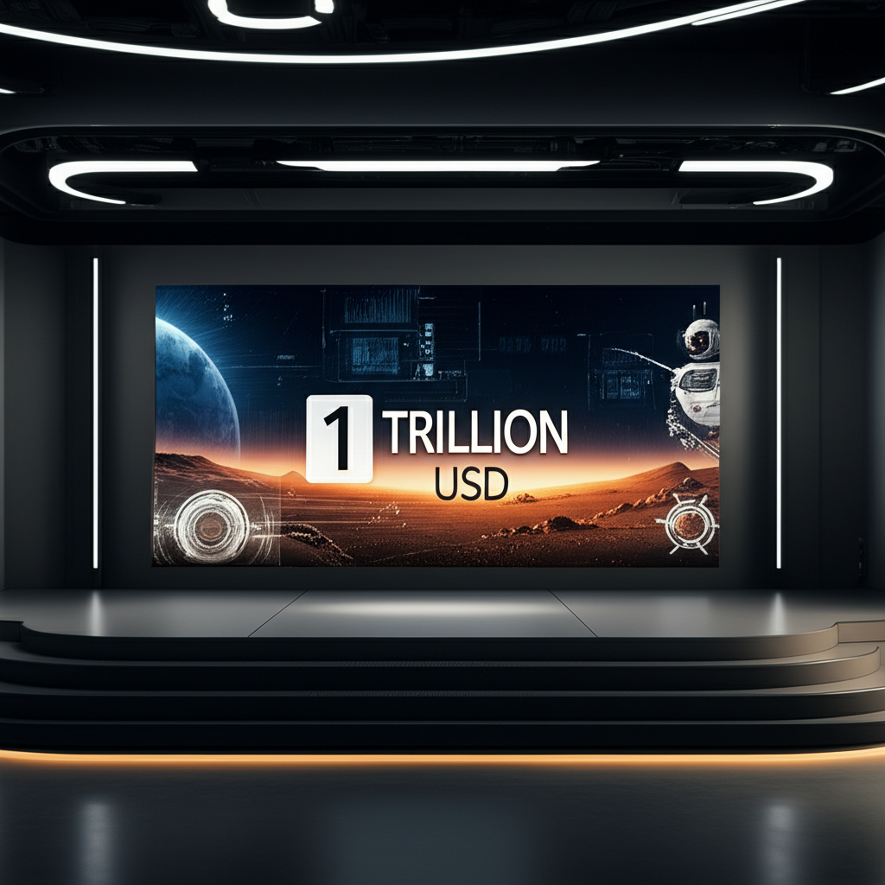

Một nghìn tỷ đô la.

Con số này không phải là ngân sách quốc phòng của một quốc gia nhỏ, mà là gói đãi ngộ đang được đề xuất cho một CEO: Elon Musk. Trong thế giới công nghệ vốn không thiếu những câu chuyện điên rồ, đề xuất này của Tesla vẫn tạo ra một cơn địa chấn.

Giữa tâm bão tranh cãi, Chủ tịch Hội đồng quản trị Tesla, bà Robyn Denholm, đã lên tiếng và gọi cuộc tranh luận này là "có một chút kỳ lạ". Nhưng liệu nó có thực sự kỳ lạ, hay đây là một canh bạc táo bạo nhất mà thế giới doanh nghiệp từng chứng kiến?

### "Nhiên Liệu Cho Tương Lai", Không Phải "Phần Thưởng Quá Khứ"

Phát biểu tại một sự kiện công nghệ gần đây, bà Denholm đã bảo vệ quyết liệt kế hoạch đãi ngộ kéo dài 10 năm, trị giá 1.000 tỷ USD cho Elon Musk. Bà nhấn mạnh rằng mọi người đang hiểu sai vấn đề.

> "Chúng ta không đang nói về một khoản tiền thưởng bằng tiền mặt. Chúng ta đang nói về việc gắn kết vị CEO tham vọng nhất thế hệ chúng ta với những mục tiêu tham vọng nhất có thể tưởng tượng được. Đây không phải là phần thưởng cho quá khứ; đây là nhiên liệu cho tương lai."

Quan điểm của bà rất rõ ràng: đây là một gói khuyến khích, không phải một tấm séc ký sẵn. Để nhận được dù chỉ một phần trong con số khổng lồ đó, Elon Musk phải dẫn dắt Tesla vượt qua những cột mốc mà nhiều người cho là khoa học viễn tưởng.

### Những Cột Mốc Không Tưởng

Vậy chính xác thì Elon Musk phải làm gì để "mở khóa" gói lương nghìn tỷ đô này? Các mục tiêu được đặt ra không chỉ khó, mà còn định hình lại toàn bộ ngành công nghiệp.

1.  **Vốn hóa thị trường đạt 10.000 tỷ USD:** Con số này lớn hơn cả vốn hóa của Apple và Microsoft cộng lại ở thời điểm hiện tại. Điều này có nghĩa là Tesla không chỉ phải bán xe điện, mà còn phải thống trị các lĩnh vực năng lượng, AI và robot.
2.  **Triển khai 20 triệu robot hình người Optimus:** Đây không còn là dự án thử nghiệm. Gói đãi ngộ yêu cầu Tesla phải sản xuất và đưa vào vận hành một đội quân robot lao động thực thụ, có khả năng thay đổi vĩnh viễn thị trường lao động toàn cầu.
3.  **Đạt được công nghệ tự lái hoàn toàn (Level 5):** Chấm dứt những cuộc tranh cãi về FSD (Full Self-Driving). Mục tiêu là mọi chiếc xe Tesla đều có thể tự vận hành an toàn trong mọi điều kiện mà không cần bất kỳ sự can thiệp nào của con người.
4.  **Thiết lập một căn cứ tự vận hành trên Sao Hỏa:** Đây có lẽ là mục tiêu gây sốc nhất. Mặc dù SpaceX là một công ty riêng, gói đãi ngộ này lại liên kết thành công của Tesla với tầm nhìn chinh phục vũ trụ của Musk. Điều này cho thấy hội đồng quản trị xem các công ty của Musk là một hệ sinh thái không thể tách rời.

### "Bánh Đà Đổi Mới" Hay Mớ Bòng Bong Lợi Ích?

Một trong những chỉ trích lớn nhất nhắm vào Elon Musk là sự phân tâm của ông giữa quá nhiều công ty: Tesla, SpaceX, X (Twitter cũ), Neuralink, The Boring Company. Các nhà đầu tư lo ngại ông không thể dành trọn tâm huyết cho Tesla.

Tuy nhiên, bà Denholm lại có một góc nhìn hoàn toàn khác. Bà gọi đó là một "bánh đà của sự đổi mới" (flywheel of innovation).

> "Mọi người thấy thời gian của Elon bị chia sẻ giữa các công ty. Chúng tôi lại thấy một bánh đà của sự đổi mới. Optimus học hỏi từ FSD. Starlink cung cấp dữ liệu cho xe Tesla. Tầm nhìn Sao Hỏa thúc đẩy những tài năng kỹ thuật xây dựng nên những chiếc xe của chúng ta. Tất cả đều được kết nối."

Lập luận này cho rằng những tiến bộ ở SpaceX sẽ thúc đẩy công nghệ vật liệu cho Tesla, AI phát triển cho xe tự lái sẽ là bộ não cho robot Optimus. Chúng không phải là những thực thể cạnh tranh thời gian của Musk, mà là những mảnh ghép cộng sinh trong một đế chế công nghệ khổng lồ.

Dĩ nhiên, các tổ chức tư vấn cổ đông như Institutional Shareholder Services (ISS) và Glass Lewis không dễ dàng bị thuyết phục. Họ lo ngại về quy mô chưa từng có của gói đãi ngộ và việc nó có thể làm loãng giá trị cổ phiếu.

### Bóng Ma Quá Khứ và Trận Chiến Phía Trước

Đây không phải là lần đầu tiên một gói lương của Elon Musk gây bão. Gói đãi ngộ trị giá 56 tỷ USD trước đó đã bị một thẩm phán ở Delaware vô hiệu hóa vì cho rằng hội đồng quản trị đã không chứng minh được tính công bằng của nó.

Giờ đây, với một đề xuất lớn hơn gần 20 lần, trận chiến chắc chắn sẽ còn khốc liệt hơn. Cuộc bỏ phiếu của các cổ đông tại đại hội thường niên sắp tới sẽ là một phép thử cho niềm tin của họ vào tầm nhìn của Elon Musk. Họ sẽ phải quyết định: Liệu đây là một sự đầu tư xứng đáng cho một tương lai vĩ đại, hay là một hành động liều lĩnh của một hội đồng quản trị quá ưu ái cho vị CEO ngôi sao của mình?

### Tổng kết

Câu chuyện về gói lương 1.000 tỷ USD không chỉ đơn thuần là về tiền bạc. Nó là một tuyên ngôn về tham vọng, một canh bạc vào một tương lai nơi Tesla không chỉ là một hãng xe, mà là một tập đoàn công nghệ định hình nền văn minh nhân loại từ mặt đất lên đến các vì sao.

Robyn Denholm có thể thấy cuộc tranh cãi này "kỳ lạ", nhưng đối với phần còn lại của thế giới, đây là một vở kịch hấp dẫn về rủi ro, phần thưởng và giới hạn của tầm nhìn trong kỷ nguyên công nghệ số. Kết quả của cuộc bỏ phiếu sắp tới sẽ không chỉ quyết định tương lai của Elon Musk, mà còn có thể là cả tương lai của chính chúng ta.

---

### Xem thêm thông tin

*   Trang chủ: [Boo Space](https://boospace.tech)
*   Kho tài nguyên: [Boo Space Gumroad](https://boospace.gumroad.com)
*   Các sản phẩm kèm theo: [Linktr](https://linktr.ee/boospace)

### Nguồn trích dẫn

*   TechCrunch: [Tesla board chair calls debate over Elon Musk’s $1T pay package ‘a little bit weird’](https://techcrunch.com/2025/09/13/tesla-board-chair-calls-debate-over-elon-musks-1t-pay-package-a-little-bit-weird/)