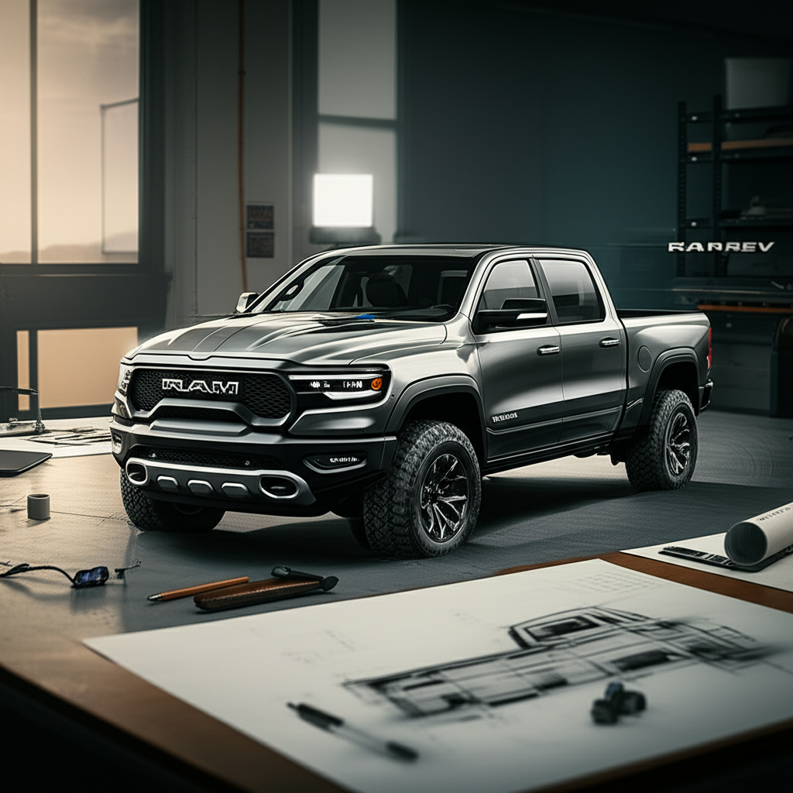

Thế giới công nghệ và xe điện vừa nhận một tin tức chấn động. Stellantis, gã khổng lồ đứng sau thương hiệu Ram, đã chính thức thông báo dừng kế hoạch phát triển dòng xe bán tải chạy hoàn toàn bằng điện. Đây là một cú phanh gấp đột ngột, đặt ra một câu hỏi lớn cho tương lai của một trong những phân khúc xe sôi động nhất Bắc Mỹ.

### Cú Quay Xe Bất Ngờ Từ Một Ông Lớn

Vào thứ Sáu vừa qua, Stellantis đã xác nhận sẽ không tiếp tục theo đuổi dự án xe bán tải cỡ lớn chạy bằng pin. Quyết định này trực tiếp khai tử mẫu Ram 1500 REV (Revolution) – một dự án từng được kỳ vọng sẽ là đối thủ đáng gờm của Ford F-150 Lightning và Chevrolet Silverado EV.

Lý do được đưa ra rất thẳng thắn: nhu cầu của thị trường chưa đủ lớn.

Trong một phát biểu đanh thép, CEO của Stellantis, ông Carlos Tavares, đã không ngần ngại chia sẻ: "Chúng ta phải thực tế. Thị trường chưa sẵn sàng để hấp thụ số lượng xe bán tải điện cỡ lớn đủ để dự án này trở nên khả thi vào lúc này. Chúng tôi sẽ không ép một sản phẩm vào một thị trường không muốn nó."

Trích dẫn này không chỉ là một lời giải thích, nó còn là một lời tuyên bố về chiến lược kinh doanh. Stellantis đang chọn cách lắng nghe dữ liệu thị trường lạnh lùng thay vì chạy theo một cuộc đua công nghệ nóng bỏng nhưng đầy rủi ro.

### Những Con Số Không Biết Nói Dối

Quyết định của Ram không phải là một cảm tính nhất thời. Nó được hậu thuẫn bởi những tín hiệu rõ ràng từ thị trường.

Mặc dù Ford F-150 Lightning có doanh số "ổn định nhưng không bùng nổ", và Chevrolet Silverado EV cũng nhận được sự đón nhận khá "hờ hững", bức tranh toàn cảnh cho thấy một thực tế phũ phàng. Phân khúc khách hàng mua xe bán tải điện hiện tại chủ yếu là những người yêu công nghệ, những người chấp nhận sớm (early adopters), chứ chưa chạm tới được nhóm khách hàng cốt lõi: những người dùng xe bán tải cho công việc thực thụ.

Đối với một người nông dân, một chủ thầu xây dựng, hay một người thường xuyên kéo theo rơ-moóc nặng, những lo ngại về xe điện là hoàn toàn có thật:

1.  **Nỗi lo về quãng đường khi kéo tải:** Đây là rào cản lớn nhất. Một chiếc xe bán tải điện có thể đi được 500km khi chạy không tải, nhưng con số này có thể giảm xuống còn một nửa hoặc thấp hơn khi phải kéo theo vài tấn hàng phía sau.
2.  **Hạ tầng sạc:** Tại các khu vực nông thôn, công trường, hay những nơi hẻo lánh, việc tìm thấy một trạm sạc nhanh vẫn là một thử thách. Thời gian sạc đầy một viên pin khổng lồ cũng là một vấn đề không nhỏ.
3.  **Giá thành:** Xe bán tải điện vẫn có giá cao hơn đáng kể so với các phiên bản động cơ đốt trong tương đương, tạo ra một rào cản tài chính lớn cho các doanh nghiệp và người dùng cá nhân.

Các mô hình AI và thuật toán phân tích dữ liệu lớn mà các tập đoàn như Stellantis sử dụng chắc chắn đã chỉ ra những điểm này. Họ không chỉ nhìn vào số đơn đặt hàng trước, mà còn phân tích hành vi, nhu cầu và những điểm đau (pain points) của tệp khách hàng trung thành. Kết quả phân tích có lẽ đã vẽ ra một kịch bản lợi nhuận thấp và rủi ro cao, dẫn đến quyết định dừng cuộc chơi.

### Không Lùi Bước, Mà Là Một Cú Xoay Trục Thông Minh

Tuy nhiên, đừng vội nghĩ rằng Ram đã từ bỏ hoàn toàn cuộc chơi điện hóa. Thay vì đối đầu trực diện, họ chọn một con đường vòng, một chiến lược "cầu nối" khôn ngoan hơn mang tên **Ramcharger**.

Đây là một mẫu xe plug-in hybrid (PHEV) với công nghệ "range-extender" (mở rộng phạm vi). Về cơ bản, chiếc xe sẽ vận hành hoàn toàn bằng điện trong các tác vụ hàng ngày, như đi làm hay di chuyển trong thành phố. Khi cần đi xa hoặc kéo tải nặng, một động cơ xăng nhỏ sẽ hoạt động như một máy phát điện, liên tục sạc lại cho pin. Chiếc xe vẫn chạy bằng động cơ điện, nhưng năng lượng được cung cấp bởi xăng khi cần.

Jessica Caldwell, một nhà phân tích tại Edmunds, nhận định: "Đây là một động thái thực dụng, dù có thể gây thất vọng cho một số người. Stellantis đang đọc vị thị trường và nhận ra rằng bước nhảy vọt lên xe điện hoàn toàn là quá lớn đối với nhiều người mua xe bán tải truyền thống vào lúc này. Ramcharger là một công nghệ cầu nối thông minh."

Giải pháp này giải quyết được gần như tất cả các vấn đề cốt lõi: không còn nỗi lo hết pin, không phụ thuộc vào trạm sạc, và vẫn mang lại trải nghiệm lái xe điện mượt mà cho phần lớn thời gian sử dụng.

### Bài Học Cho Cuộc Cách Mạng Xe Điện

Sự kiện của Ram là một gáo nước lạnh cần thiết cho sự hưng phấn của ngành công nghiệp xe điện. Nó cho thấy con đường điện hóa không phải là một đường thẳng. Mỗi phân khúc thị trường có những nhu cầu và rào cản riêng, và việc áp dụng một công thức chung cho tất cả là điều không thể.

Trong khi những thương hiệu như Rivian và Tesla có thể thành công với tệp khách hàng đam mê phiêu lưu và công nghệ, thì những người khổng lồ như Ram, Ford, GM phải đối mặt với một thực tại khác: phục vụ hàng triệu khách hàng truyền thống, những người xem chiếc xe bán tải là một công cụ lao động không thể thiếu.

### Tổng kết

Quyết định của Ram không phải là một thất bại, mà là một sự điều chỉnh chiến lược dựa trên dữ liệu và sự thấu hiểu khách hàng sâu sắc. Họ đã chọn không tham gia một cuộc đua mà họ tin rằng chưa có vạch đích rõ ràng. Thay vào đó, họ tạo ra một lối đi riêng với Ramcharger, một sản phẩm có thể đáp ứng tốt hơn nhu cầu thực tế của người dùng ở thời điểm hiện tại.

Đây là một lời nhắc nhở rằng trong thế giới công nghệ, đôi khi người chiến thắng không phải là người đi nhanh nhất, mà là người đi đúng hướng nhất.

---

**Xem thêm thông tin:**

- Trang chủ: [Boo Space](https://boospace.tech)
- Kho tài nguyên: [Boo Space Gumroad](https://boospace.gumroad.com)
- Các sản phẩm kèm theo: [Linktr](https://linktr.ee/boospace)

---

**Nguồn trích dẫn:**

- TechCrunch: [Ram ends EV pickup truck plans](https://techcrunch.com/2025/09/12/ram-ends-ev-pickup-truck-plans/)